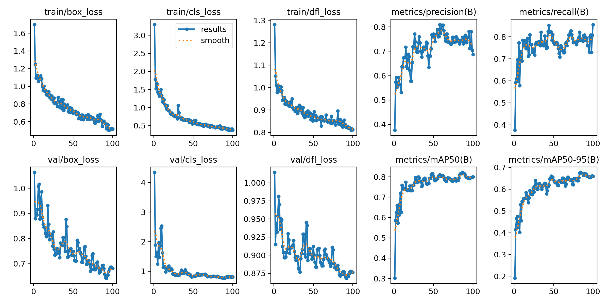

# **YOLO Jasmine Bud Detection Models**

## **Introduction**
The **YOLO Jasmine Bud Detection** project focuses on classifying jasmine buds into **open buds** and **closed buds** using advanced YOLO (You Only Look Once) object detection architectures.  
Custom datasets of jasmine flowers were collected and annotated, followed by training and fine-tuning of YOLO models (YOLOv5 and YOLOv8 variants).  
The aim is to create a robust vision-based system for **smart agriculture applications**, particularly in **flower monitoring, harvesting automation, and yield estimation**.  

---

## **Model Performance Comparison**

| **Model**   | **Precision** | **Recall** | **mAP [0.5]** | **mAP [0.5:0.95]** |
|-------------|--------------|------------|---------------|--------------------|
| YOLOv5s     | 0.731        | 0.765      | 0.809         | 0.519              |
| YOLOv8s     | 0.746        | 0.785      | 0.816         | 0.678              |
| YOLOv8m     | 0.687        | 0.802      | 0.817         | 0.683              |
| YOLOv8l     | 0.753        | 0.791      | 0.828         | 0.703              |

---

## **YOLO Jasmine Detection Demo (GIF)**  
Sample detection in action:

## **YOLOv5s Jasmine**
Sample detection results:

---

## **YOLOv8s Jasmine**
Sample detection results:

  

---

## **YOLOv8m Jasmine**
Sample detection results:

  
---

## **YOLOv8l Jasmine**
Sample detection results:

  

---

## **Conclusion**
This project demonstrates the potential of **YOLO-based deep learning models** in **agricultural automation**.  
The results show that YOLOv8 variants (particularly **YOLOv8l**) achieved better **accuracy and detection reliability** compared to YOLOv5s.  
These models can significantly contribute to **automated jasmine bud classification, precision farming, and real-time monitoring systems**.  

---

## **ISBN** : **xxx-xxx--xxx-xxx**

---

## **Citation**
If you use this repository or dataset, please cite the following:

**APA Style Citation:**  
Kamalesh Kanna S., & Keerthivasan R. (2025). *Deep learning for jasmine bud classification: Advancing smart agriculture through YOLO-based vision systems*. AGSC 2025.  

---